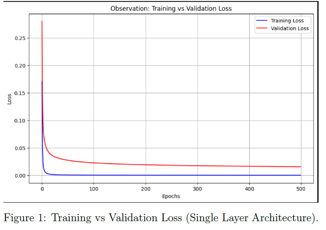
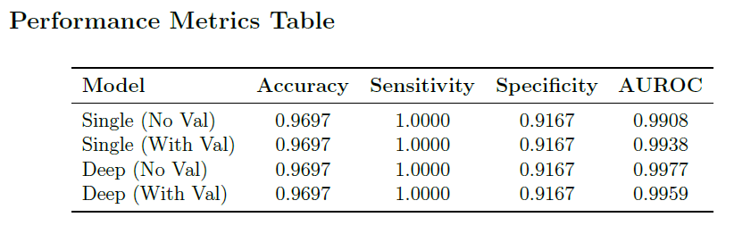
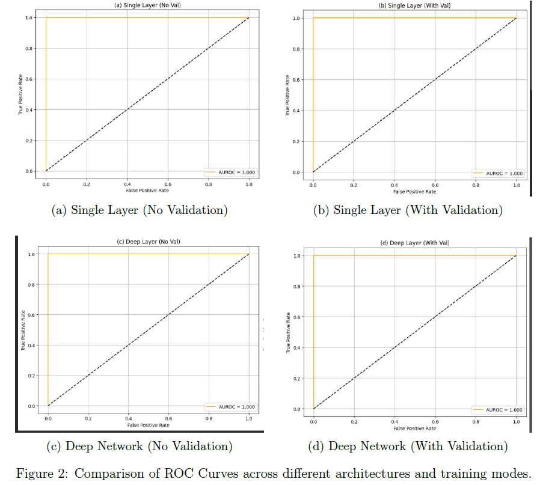

# 🧬 Ovarian Cancer Classification using Artificial Neural Networks

## 📌 Overview
This project implements a feedforward Artificial Neural Network (ANN) to classify ovarian cancer samples using gene expression data. The model learns complex biological patterns from high-dimensional features to distinguish between cancerous and non-cancerous samples, demonstrating the application of deep learning techniques in biomedical data analysis.

The objective of the project is to understand neural network fundamentals while applying them to a real-world healthcare prediction problem.

---

## 🎯 Objectives
- Build an ANN classifier from scratch  
- Implement forward propagation and backpropagation manually  
- Train using gradient descent optimization  
- Evaluate using medically relevant metrics  
- Understand deep learning applications in computational biology  

---

## ⚙️ Methodology

### 1️⃣ Data Preprocessing
- Gene expression normalization  
- Handling high-dimensional feature vectors  
- Train–test split for evaluation  

### 2️⃣ Model Architecture
- Fully connected feedforward ANN  
- Non-linear activation functions  
- Binary classification output layer  

### 3️⃣ Training Process
Manual implementation of:
- Forward propagation  
- Backpropagation  
- Loss computation  
- Stochastic Gradient Descent updates  

### 4️⃣ Evaluation Metrics
- Accuracy  
- Sensitivity (Recall)  
- Specificity  
- AUROC score  

These metrics are important for medical diagnosis tasks where minimizing false negatives is critical.

---

## 🛠️ Tech Stack
- Python  
- NumPy  
- Artificial Neural Networks  
- Gradient Descent Optimization  
- Data Normalization  

---

## 📊 Results

### 🔹 Training Performance

### 🔹 Model Evaluation Metrics

### 🔹 ROC Curve

---

## 🚀 Future Improvements
- Add regularization to reduce overfitting  
- Compare ANN with SVM, Random Forest, and deep models  
- Apply feature selection / dimensionality reduction  
- Extend to multi-class cancer detection  

---

## 📚 Learning Outcomes
Through this project, I gained hands-on experience with:

- Neural network implementation from scratch  
- Optimization and convergence behavior  
- Model evaluation in sensitive healthcare domains  
- Working with high-dimensional biological datasets  

---

## 👨‍💻 Author
**Tarun Kayala**
B.Tech Electronics & Communication Engineering  
Deep Learning / Machine Learning Enthusiast
